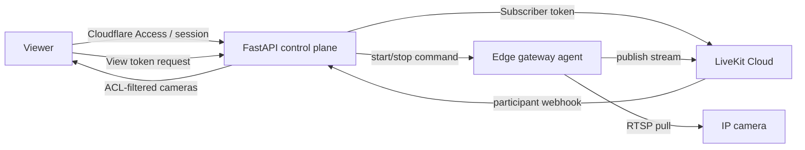

# 01 - System Analysis

## Project Overview

Panoptix is a secure live-view CCTV monitoring system. It connects fixed IP cameras to authenticated browser viewers through a three-plane architecture:

| Plane | Current evidence | Status |
|---|---|---|
| Control plane | FastAPI backend in `apps/api/src/cctv_api`, SQLAlchemy models, Alembic migrations, tests, Railway staging docs | Existing |
| Media plane | LiveKit Cloud token minting, webhook receiver, room-presence command enqueue, fallback mode flag | Partially Existing |
| Camera plane | Edge agent, outbound heartbeat/control, FFmpeg/LiveKit scaffolds, mediamtx local config | Partially Existing |
| Frontend | `apps/web/README.md` placeholder and frontend docs | Missing implementation |

The system is designed for browser viewing only. Browser, phone, and laptop camera publishing are explicitly out of scope.

## System Purpose

Panoptix enables authorized users to view assigned CCTV cameras while keeping camera credentials and camera network access outside the browser and outside the public internet. The backend enforces identity, roles, camera ACLs, session controls, audit logging, gateway coordination, and compliance-related records.

## Objectives

- Provide authenticated browser access to assigned live CCTV cameras.
- Enforce admin-only management of users, cameras, gateways, audit, break-glass, compliance artifacts, and maintenance operations.
- Keep RTSP camera credentials on the local gateway only.
- Deliver viewer and gateway LiveKit tokens with distinct, short-lived grants.
- Maintain tamper-evident audit records for security-sensitive actions.
- Support developer, frontend, database, QA, and operations handoff with clear documented contracts.

## Scope

| Area | Scope statement | Status |
|---|---|---|
| Viewer camera list and token access | Backend returns only active cameras with active ACLs and mints subscriber tokens | Existing |
| Admin camera, gateway, and user onboarding | Backend supports camera/gateway lifecycle control and GitHub-backed user invites | Existing |
| Gateway command/control | Persistent command queue plus WebSocket and heartbeat fallback | Existing |
| Edge publishing | Agent verifies commands and has LiveKit/FFmpeg scaffolds; real hardware validation pending | Partially Existing |
| Frontend | Required UX and integration docs exist; application code is not implemented | Missing |
| Recording/playback/snapshots | Excluded from MVP | Out of scope |
| Backup operations | R2 provisioning docs, scripts, and database-known backup status API exist; restore drill evidence pending | Partially Existing |

## Limitations

- No implemented Next.js/React frontend was found in `apps/web/`.
- Real camera onboarding and production camera-to-LiveKit publishing require physical hardware.
- Backend DSR workflow APIs exist; frontend DSR case management UI is still pending.
- Self-hosted LiveKit fallback is represented by docs/configuration and a mode switch, not full operations.

## Users And Roles

| Actor | Description | Evidence | Status |
|---|---|---|---|
| Viewer | Authenticated user who can view assigned cameras only | `GET /api/v1/cameras`, camera ACL checks, `viewer` role seed | Existing |
| Admin | Manages users, cameras, gateways, audit, break-glass, compliance, and maintenance | Admin routes require `admin` role | Existing |
| Gateway | Machine identity for on-site edge agent | Gateway auth dependencies, service token hash, gateway routes | Existing |
| Auditor | Persona in UX docs for audit/compliance review | Frontend UX docs; no separate code role found | Needs Team Confirmation |
| SuperAdmin | Persona for high-risk recovery | UX docs; no distinct database/code role found | Needs Team Confirmation |

## Existing Modules

- Authentication and identity: Cloudflare Access verification, local dev auth, signed sessions.
- Authorization: role checks plus camera ACLs and gateway-camera assignments.
- Camera management: create, list, detail, disable/retire, user ACL grant/revoke.
- Gateway management: create, list, detail, update, disable, enable, rotate credentials, assign cameras.
- User onboarding: GitHub organization invite plus local Panoptix role preparation.
- Gateway command queue: enqueue, list, cancel, expire, ACK processing, signed envelopes.
- LiveKit integration: viewer tokens, gateway tokens, webhooks, room-presence-driven start/stop.
- Audit: HMAC-chained audit rows, verification, listing, export.
- Privacy and compliance: privacy notice acceptance, DPA export, DSR workflow tracking, signage attestation.
- Operations: health checks, maintenance job, runbooks, CI/security scans, backup scripts.
- Edge agent: heartbeat, command verification, command execution, supervisor, media scaffolds.

## Proposed Or Missing Modules

| Module | Rationale | Status |
|---|---|---|
| Frontend web application | Required for viewer dashboard and admin workflows | Missing |
| Real hardware onboarding workflow | Required to validate real camera publishing | Partially Existing |
| DSR workflow UI | Backend DSR API exists; browser workflow is still frontend work | Missing |
| Backup worker and restore drill evidence | Status endpoint reads `backup_runs`, but production backup artifacts and restore evidence are pending | Partially Existing |
| Production self-hosted LiveKit fallback runbook/execution | Fallback mode exists but full operations remain future work | Partially Existing |

## Main Workflows

## Assumptions

- The current branch represents the intended current project state.
- Existing dirty files outside `docs/system-analysis/` are unrelated and should not be reverted.
- Frontend and database ownership boundaries in existing docs remain authoritative unless the team changes them.

## Risks

| Risk | Impact | Recommendation |
|---|---|---|
| Frontend not implemented | MVP cannot be used by end users despite backend readiness | Build frontend against documented API contract |
| Hardware not onboarded | Real live camera behavior remains unproven | Procure and validate with supported RTSP cameras |
| Documentation/code drift | Frontend or QA may build against wrong fields | Treat code and API tests as authoritative and update docs |
| DSR workflow has no UI | Compliance case tracking is API-only until frontend work lands | Build DSR case management UI against the implemented backend routes |

## Constraints

- Browser must never publish media.
- Gateway connections must remain outbound-only.
- RTSP credentials must stay on the gateway.
- Gateway publish tokens must not be returned to browsers.
- Security-sensitive actions must be audited.
- Real secrets must not be committed.

## Recommendations

- Use `docs/system-analysis/` as a handoff index for analysts, QA, frontend, and backend developers.
- Fix the documented camera source type mismatch in `docs/frontend/BACKEND_STATUS.md`.
- Add frontend implementation and E2E tests before MVP acceptance.
- Treat real hardware onboarding as a release gate for camera streaming.
- Keep Cloudflare Access policies aligned with the configured GitHub organization/team used for invites.

## Project Inventory Summary

| Inventory item | Found evidence |
|---|---|
| Important folders | `apps/api`, `apps/cctv-edge`, `apps/web`, `database`, `docs`, `infra`, `scripts`, `.github` |
| Important source files | `apps/api/src/cctv_api/api/router.py`, `apps/api/src/cctv_api/api/gateways.py`, `apps/api/src/cctv_api/models/tables.py`, `apps/cctv-edge/agent/src/panoptix_edge_agent/cli.py` |
| Existing documentation | `docs/index.md`, planning docs, API reference, test plan, frontend docs, runbooks, security docs, ADRs |
| Database files | `apps/api/alembic/versions/*.py`, `apps/api/src/cctv_api/models/*.py`, `docs/architecture/erd.mmd` |
| UI files | `apps/web/README.md` placeholder; frontend specs in `docs/frontend/` |
| API files | FastAPI routers under `apps/api/src/cctv_api/api/` |
| Reports/export logic | Audit export, DPA export, health dashboard data, backup scripts/status API |
| Features confirmed from code | Auth, sessions, CSRF, RBAC, camera ACL, gateway control, LiveKit tokens/webhooks, audit, break-glass, DPA/signage |
| Features documented but not found as complete code | Frontend UI, DSR workflow UI, full self-hosted fallback |
| Features found in code but under-documented or inconsistent | Actual `CameraSourceType` enum differs from `docs/frontend/BACKEND_STATUS.md` |

