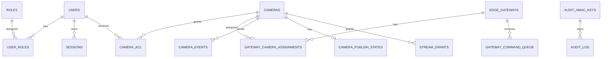

# 06 - Data Requirements And Data Dictionary

## Existing Database Artifacts

Database evidence was found in `apps/api/src/cctv_api/models/tables.py`, `apps/api/src/cctv_api/models/enums.py`, `apps/api/alembic/versions/`, `docs/architecture/erd.mmd`, and `docs/database/`.

## Entity Summary

| Entity/Table | Purpose | Status |
|---|---|---|
| `users` | Application users mapped to identity provider subjects | Existing |
| `roles`, `permissions`, `role_permissions`, `user_roles` | RBAC definitions and assignments | Existing |
| `sessions` | Signed application session tracking | Existing |
| `sites` | Physical CCTV sites and signage attestation timestamp | Existing |
| `edge_gateways` | On-site gateway identities and lifecycle status | Existing |
| `cameras` | Camera registry and LiveKit room mapping | Existing |
| `camera_acl` | Per-user camera access grants/revocations | Existing |
| `gateway_camera_assignments` | Per-gateway camera publishing permissions | Existing |
| `camera_events` | Camera/gateway status events | Existing |
| `camera_publish_states` | Room-presence-driven publish state | Existing |
| `gateway_command_queue` | Persistent gateway commands and ACK state | Existing |
| `stream_grants` | Issued viewer/gateway LiveKit grants | Existing |
| `audit_hmac_keys`, `audit_log` | HMAC key versions and tamper-evident audit chain | Existing |
| `break_glass_usage` | Emergency access lifecycle | Existing |
| `privacy_notice_acceptances` | Versioned privacy notice acceptance | Existing |
| `dpa_artifacts`, `dsr_requests` | Compliance artifacts and DSR ledger | Backend Existing |
| `system_config` | Runtime configuration values such as media-plane mode | Existing |
| `backup_runs` | Backup execution metadata | Partially Existing |
| `webhook_replay_cache` | LiveKit webhook replay prevention | Existing |

## Key Relationships

## Data Dictionary

### Users And RBAC

| Table | Field | Description | Type | Required | Constraints | Status |
|---|---|---|---|---|---|---|
| `users` | `id` | User UUID | UUID | Yes | Primary key | Existing |
| `users` | `email` | User email | String(320) | Yes | Unique | Existing |
| `users` | `idp_subject` | Identity provider subject | String(255) | No | None found | Existing |
| `users` | `role_default` | Default role marker | String(64) | Yes | Default `none` | Existing |
| `users` | `disabled_at` | Disable timestamp | DateTime TZ | No | Null means active | Existing |
| `roles` | `name` | Role name | String(64) | Yes | Unique | Existing |
| `permissions` | `action`, `resource` | Permission tuple | String | Yes | Unique pair | Existing |
| `sessions` | `id`, `user_id` | Session identifier and owner | UUID | Yes | FK to users | Existing |
| `sessions` | `cf_jti`, `ua_fp`, `ip` | Session metadata | String/INET | No | None found | Existing |
| `sessions` | `created_at`, `last_seen_at`, `revoked_at` | Session lifecycle timestamps | DateTime TZ | Mixed | Revoked null means active | Existing |

### Cameras, Gateways, And Streaming

| Table | Field | Description | Type | Required | Constraints | Status |
|---|---|---|---|---|---|---|
| `sites` | `id`, `name`, `address` | Physical site data | UUID/String | Name required | Primary key | Existing |
| `sites` | `bystander_signage_attested_at` | Site signage attestation timestamp | DateTime TZ | No | None found | Existing |
| `edge_gateways` | `id`, `name` | Gateway identity and display name | UUID/String | Yes | Primary key | Existing |
| `edge_gateways` | `status` | Gateway lifecycle | Enum | Yes | `enabled`, `disabled`, `retired` | Existing |
| `edge_gateways` | `service_token_hash` | Hashed service token | String(255) | No | Plain token not stored | Existing |
| `edge_gateways` | `mtls_fingerprint`, `cert_expires_at` | mTLS metadata | String/DateTime | No | Future/pilot support | Existing |
| `cameras` | `id`, `display_name` | Camera identity and label | UUID/String | Yes | Primary key | Existing |
| `cameras` | `source_type` | Camera source category | Enum | Yes | Actual enum values only | Existing |
| `cameras` | `room_uuid`, `livekit_room_name` | LiveKit room identifiers | UUID/String | Yes | `livekit_room_name` unique | Existing |
| `cameras` | `gateway_id`, `site_id` | Optional direct associations | UUID | No | FK references | Existing |
| `cameras` | `retired_at` | Camera retirement timestamp | DateTime TZ | No | Null means active | Existing |
| `camera_acl` | `user_id`, `camera_id`, `granted_at` | ACL grant identity/history | UUID/DateTime | Yes | Composite PK | Existing |
| `camera_acl` | `revoked_at` | ACL revocation timestamp | DateTime TZ | No | Unique active user/camera | Existing |
| `gateway_camera_assignments` | `gateway_id`, `camera_id`, `granted_at` | Gateway publish assignment | UUID/DateTime | Yes | Unique active assignment | Existing |
| `camera_events` | `kind`, `source`, `at` | Status event details | Enums/DateTime | Yes | Indexed by camera/time | Existing |
| `camera_publish_states` | `status`, `last_viewer_count`, `stop_due_at` | Publish lifecycle state | Enum/Integer/DateTime | Yes/Mixed | Indexed by status/due | Existing |
| `stream_grants` | `kind`, `jti`, `issued_at`, `expires_at` | Issued token grant metadata | Enum/String/DateTime | Yes | Indexed by camera/time | Existing |

### Audit, Compliance, Operations

| Table | Field | Description | Type | Required | Constraints | Status |
|---|---|---|---|---|---|---|
| `audit_hmac_keys` | `version`, `key_enc` | Audit key version and encrypted key | Integer/Binary | Yes | Primary key | Existing |
| `audit_log` | `id`, `ts`, `actor_type`, `action`, `resource` | Audit event identity | BigInt/DateTime/String | Yes | Timestamp index | Existing |
| `audit_log` | `prev_hash`, `hash`, `hmac_key_version`, `payload` | Chain verification fields | String/Integer/JSONB | Mixed | FK to HMAC key | Existing |
| `break_glass_usage` | `opened_at`, `closed_at`, `auto_disable_at` | Emergency access lifecycle | DateTime TZ | Mixed | Opened index | Existing |
| `privacy_notice_acceptances` | `user_id`, `notice_version`, `accepted_at` | Versioned notice acceptance | UUID/String/DateTime | Yes | Composite PK | Existing |
| `dpa_artifacts` | `kind`, `path_to_r2`, `signed_hash` | Compliance artifact metadata | Enum/String | Mixed | DPA enum | Existing |
| `dsr_requests` | `requester_contact`, `subject_type`, `request_type`, `due_at`, `status` | DSR case tracking | String/Enum/DateTime | Yes | Due index | Backend Existing |
| `system_config` | `key`, `value`, `updated_by`, `updated_at` | Runtime configuration | String/UUID/DateTime | Yes | Primary key | Existing |
| `backup_runs` | `started_at`, `finished_at`, `size_bytes`, `sha256`, `upload_status` | Backup run metadata | DateTime/BigInt/String/Enum | Mixed | Status enum | Partially Existing |
| `webhook_replay_cache` | `provider`, `signature`, `ts`, `expires_at` | Webhook replay key | String/DateTime | Yes | Composite PK | Existing |

## Data Gaps

| Gap | Impact | Recommendation |
|---|---|---|
| DSR API and frontend API wiring exist, but production browser smoke is pending | Compliance workflow should not be treated as production-ready until the UI flow is verified | Smoke-test DSR case management and add E2E coverage |
| Backup metadata depends on backup job writes | Admin status is only as accurate as `backup_runs` rows written by the backup workflow | Keep backup job/runbook responsible for recording upload and restore validation evidence |
| `sites.bystander_signage_attested_at` and `dpa_artifacts` both relate to signage | Risk of unclear source of truth | Confirm how site timestamp and artifact record should synchronize |
| Frontend source type docs were corrected; frontend runtime validation still needs smoke evidence | UI validation may still drift from backend enum if code is changed later | Keep docs/client types aligned with actual enum and cover camera create/update in browser smoke |

